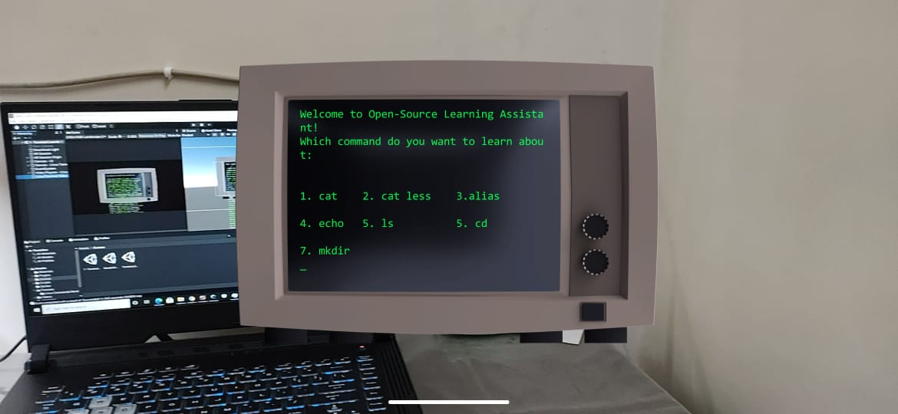
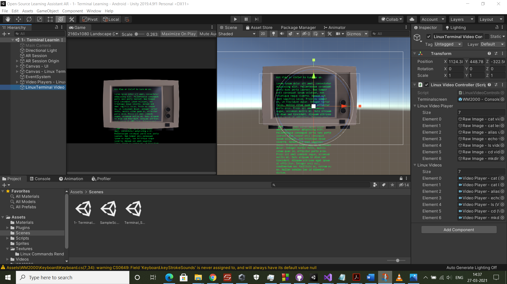
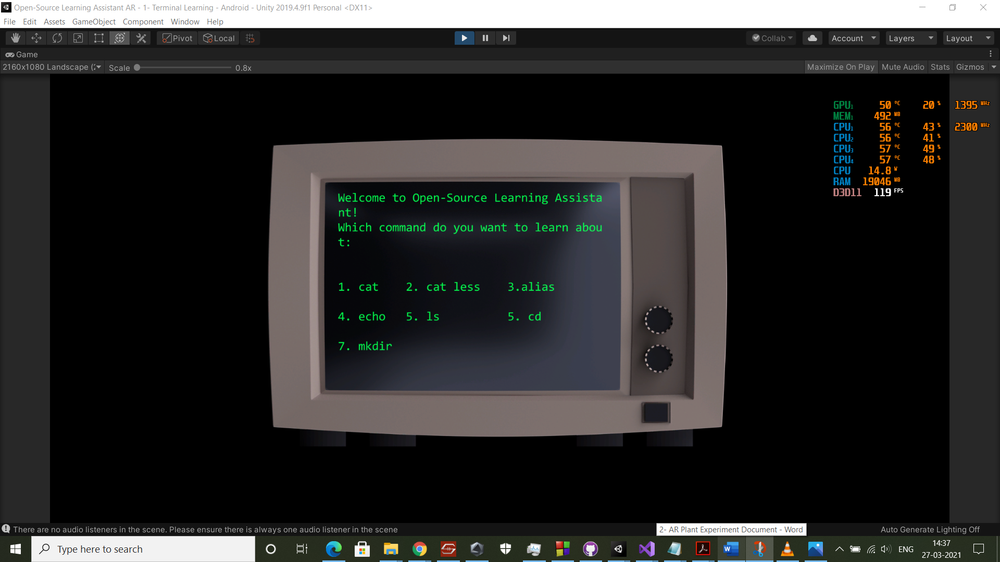
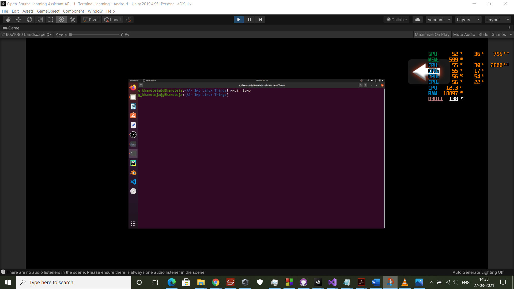

# BitBox_Project_2021-1     
Do leave a star :star: if you like this repo :blush:     

The Project aims at teaching the basic linux commands is most fun way possible making the use of Augnmented Reality     

# Features
* Aims at teaching linux commands using Augmented Realuty
* Record user behaviour and extimated time in which user can learn all commands     

# Screenshots    

      

    
 

  
 

 
  
